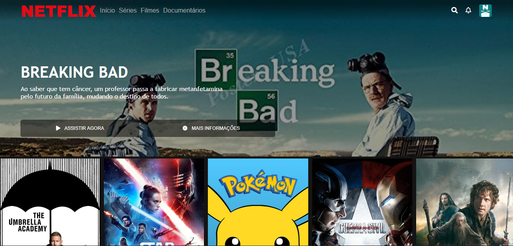

 

# netflix-clone
> Clone da Netflix desenvolvido em um dos projetos práticos da Digital Inovation One.
> Além do que foi desenvolvido no curso, também foi adicionado o menu de navegação de usuário, no canto superior direito.

## Status de desenvolvimento
A versão disponível nesta branch já está concluída e não deve mais sofrer alterações.

>Uma nova versão será feita em breve, onde o projeto será reconstruído utilizando ReactJS.

## Acesso à página

A página desenvolvida pode ser acessada [neste link](https://gustavogod.github.io/netflix-clone/).

## 🛠 Tecnologias utilizadas:

- [HTML](https://html.spec.whatwg.org/multipage/)
- [CSS](https://www.w3.org/TR/CSS/#css)
- [JavaScript](https://developer.mozilla.org/en-US/docs/Web/JavaScript)

## 🧔 Autor
 

Feito com ❤️ por Gustavo Oliveira Dias 👋🏽

 

## 🔑 Licença 

Este projeto está sob licença do [MIT](https://opensource.org/licenses/mit-license.php).
